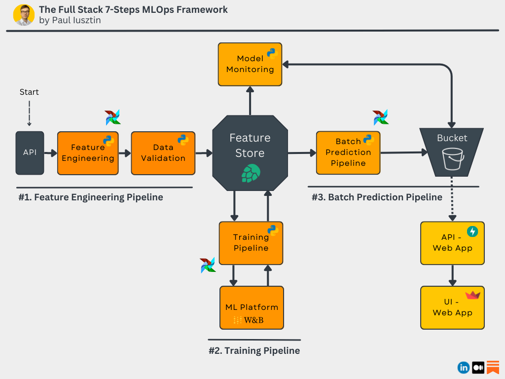
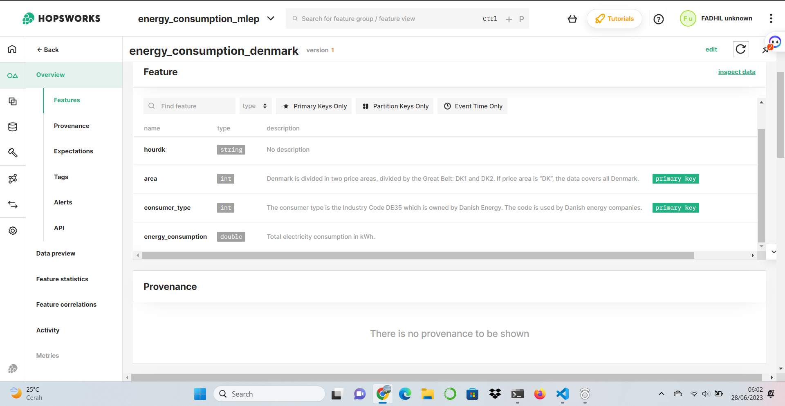
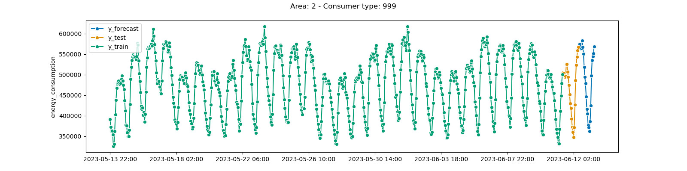

# Developing a Scalable Batch Architecture for Energy Consumption Forecasting
## Introduction

Welcome to my repository! In this project, I will develop an ML model that can predict energy consumption levels based on 
data obtained from the [Energidataservice](https://www.energidataservice.dk/). The goal is to build a reliable and production-ready 
model that can accurately predict energy consumption levels for the next 24 hours across various consumer types in Denmark. 
By leveraging machine learning and best practices in MLOps, I aim to provide valuable insights for energy planning, resource optimization, 
and decision-making in the energy sector. Let's embark on this exciting journey of building an ML model ready for energy consumption prediction in Denmark!

**Note:** This project is open to anyone who wants to contribute, such as adding features, fixing bugs, updating code, and so on.
 
#### Table of Contents
1. [Problem Statement](#problem-statement)
2. [Project Goals](#project-goals)
3. [Data Source](#data-source)
4. [Data Extraction, Transformation, and Loading (ETL)](#etl-pipeline)
5. [Model Development and Training](#model_training)
6. [Batch Training](#batch-training)
7. Monitoring and Maintenance
8. Conclusion
9. References

## Problem Statement<a name="problem-statement"></a>
Energy consumption levels are vital information in energy resource planning and management. However, accurate predictions of future energy consumption 
levels are crucial for optimizing energy production and distribution. Therefore, the main objective of this project is to build a model capable of 
predicting energy consumption levels for the next 24 hours with high accuracy. The model will consider various factors such as time, consumer types, 
and other relevant variables to generate more precise predictions.

In this git repository, you will find code and related files used in model development and MLOps implementation. Additionally, documentation and 
guidelines will be provided to guide you through the necessary steps involved in building, training, serving, and monitoring the model.

## Project Goals<a name="project-goals"></a>

The main objective of this project is to design, implement, deploy, and monitor a batch ML system that can predict energy consumption levels for the 
next 24 hours. By following best practices in MLOps, the aim is to create a production-ready model that is not only accurate but also scalable and easy 
to maintain. Throughout this project, the focus will be on building a reliable feature engineering pipeline, implementing efficient data processing 
techniques, and integrating necessary tools such as experiment tracking, model registry, feature store, and more. Below is a picture of the architecture.





## Data Source<a name="data-source"></a>
The data for this project will be obtained from a web API provided by the 
[Energy Data Service](https://www.energidataservice.dk/tso-electricity/ConsumptionDE35Hour#metadata-info). This API provides detailed information on 
energy consumption levels for various consumer types in Denmark. The dataset includes timestamps, area information, consumer types, and energy 
consumption values. By leveraging this rich data source, I will be able to train and evaluate our ML model to accurately predict energy consumption levels.

Here is a brief description of the data:

- Timestamp (datetime_utc): The date and time when the energy consumption data was recorded.
- Area (area): The geographical area in Denmark associated with the energy consumption.
- Consumer Type (consumer_type): The type of consumer (e.g., households, commercial, industrial) measured for energy consumption.
- Energy Consumption (energy_consumption): The recorded energy consumption value for a specific timestamp, area, and consumer type.

## Data Extraction, Transformation, and Loading (ETL)<a name="etl-pipeline"></a>

In this project, the ETL steps performed include:

1. Accessing [Hopsworks](hopsworks.ai) and creating the "energy_consumption_mlep" project with a new API key.
2. Utilizing utility files and functions like utils.py to load JSON files and log activities.
3. Executing the ETL process through pipeline.py by calling functions from extract.py, transform.py, validation.py, and load.py. This includes extracting data from the API, transforming the data, and validating data quality.
4. Loading the transformed data into the feature store with the integration of Great Expectations for data quality validation.
5. Integrating the project with Hopsworks, utilizing the feature store, adding feature descriptions, and calculating statistics for each feature.
6. After that, to create a new feature view and training dataset version.

By following these ETL steps, I was able to prepare the necessary data using appropriate tools and maintain good data quality throughout the process. 
All the scripts related to the ETL pipeline can be found in the 
[feature_pipeline](https://github.com/isa96/mlep-energy-forecasting/tree/main/feature_pipeline) folder.`

open your terminal clone repository :
```
    >>>git clone https://github.com/isa96/mlep-energy-forecasting.git

    >>>cd feature_pipeline
```
process etl:
```
    >>>python pipeline.py
```
get feature view and feature version:
```
    >>>python feature_view.py
```



## Model Development and Training<a name="model_training"></a>

In this stage, I will create a model using sktime and LightGBM for forecasting the next 24 hours. I will use W&B (Weights & Biases) to track experiments,
model registry, track artifacts, and perform hyperparameter tuning to obtain the best model. Based on the best configuration found during the 
hyperparameter tuning step, I will train the final model on the entire dataset and save it to the Hopsworks model registry for further use in 
the batch prediction pipeline. The following are the steps:

1. Sign up/Login to the wandb account:
    - Create a new API key.
    - Create a new project named "mlep_consumption_energy".
2. Load data from the feature store:
    - Access the feature store.
    - Retrieve references to the feature view and dataset versions.
    - Record all metadata related to dataset splitting, along with some basic statistics for each split, such as size and feature distribution.
3. Model Creation:
    - Create a Baseline model.
    - Create a model using sktime and LightGBM.
    - Build a pipeline.
4. Hyperparameter Optimization:
    - Load the dataset from the feature store based on the data and feature view versions, and store metadata from the run, including the sweep_id from 
	  the hyperparameter search.
    - Retrieve the training data, create a new sweep, and start the W&B agent. In a single sweep run, we build and train the model using cross-validation.
    - Use the Mean Absolute Percentage Error (MAPE) metric for evaluation.
5. Select the best configuration with the lowest MAPE and upload the best configuration as an artifact. This will be used later to train the model on 
   the entire dataset with the best configuration.
6. Train the Model using the Best Configuration:
    - Load the best_config artifact.
    - Build the baseline model, train, and evaluate it on the test split.
    - Build, train, and evaluate the advanced model using the latest best configuration.
    - Retrain the model on the entire dataset. This is crucial for time series models as they need to be trained on the most up-to-date data to 
	  predict the future.
    - Display the prediction results.
    - Save the best model in the Hopsworks model registry.

Tabel metrics with best model & experiments
| Model           |      MAPE       |      RMSPE     |
|-----------------|---------------- |----------------|
| baseline        |      0.1493     |     0.05767    |
| best_model      |      0.1467     |     0.06427    |

To run these scripts HPO, use the following commands in the terminal or command prompt:

```
    >>>cd training_pipeline

    >>>python hyperparameter_tuning.py
```
training model with best config:
```
    >>>python best_config.py
```
and last training all data with baseline and bestconfig:
```
    >>>python train.py
```

here example forecast:


## Batch Training<a name="batch-training"></a>
In the batch pipeline there are several steps, namely:
- Load data from the feature store in batch mode
- Load the model from the model registry
- Make predictions
- Saving the prediction in the Google Cloud Store Bucket

Now, all you have to do is to go to your project at the same level as your Poetry files (the ones mentioned above — for example, go to 
your batch-prediction-pipeline directory) and run:
```
>>>poetry build
```
This will create a dist folder containing your package as a wheel. Now you can directly install your package using the wheel file or deploy it to a 
PyPi server.
To deploy it, configure your PyPi server credentials with the following:
```
>>>poetry config repositories.<my-pypi-server> <pypi server URL>
>>>poetry config http-basic.<my-pypi-server> <username> <password>
```
Finally, deploy it using the following:
```
>>>poetry publish -r <my-pypi-server>
```
article https://archive.ph/bJfoy
